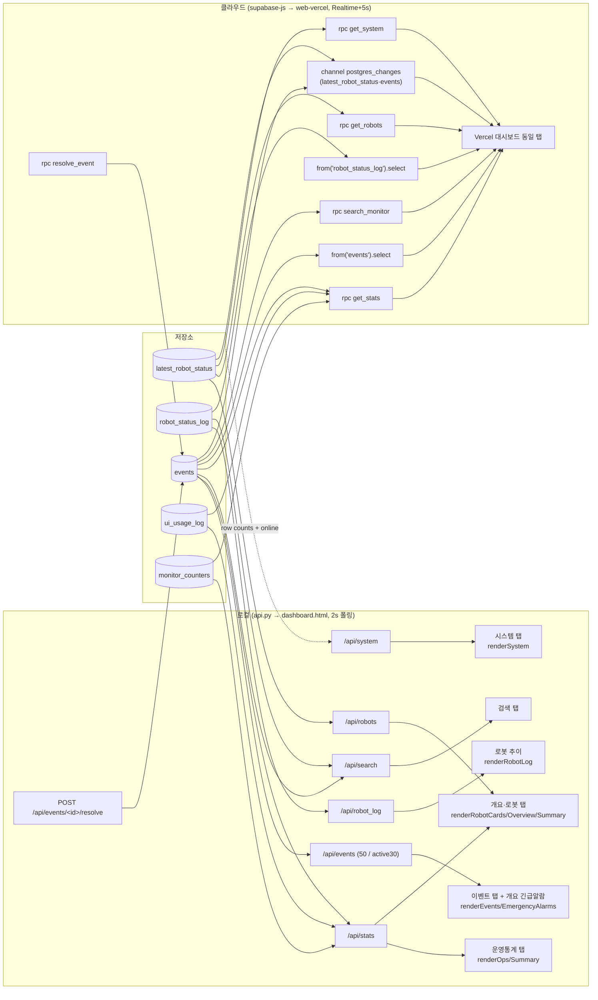

# DB → UI 데이터 흐름 아키텍처

> 코드리뷰용. **DB에 저장된 정보를 UI가 어떻게 뽑아 쓰는지** — 테이블 → API/RPC → 화면(탭/요소) 추적.
> 두 경로: **로컬**(SQLite → Flask `api.py` → `dashboard.html`, 2초 폴링) / **클라우드**(Supabase → supabase-js → `web-vercel/index.html`, Realtime+5초 폴링).
> 실제 코드(`api.py` 엔드포인트, `dashboard.html` 렌더함수, `web-vercel` `.from()/.rpc()`) 기준.

---

## 1. 흐름도

---

## 2. 로컬 경로 매핑 (SQLite → `api.py` → `dashboard.html`)

`load()`가 **2초마다** `Promise.all`로 6개를 동시 폴링: `/api/robots`, `/api/events?limit=50`, `/api/events?active=1&limit=30`, `/api/stats`, `/api/system`, `/api/robot_log?limit=200`.

| DB 테이블 | API 엔드포인트(api.py) | 처리 | UI 렌더(dashboard.html) → 화면 |
|---|---|---|---|
| `latest_robot_status` | `/api/robots` | `_robot_snapshots()` + ROBOT_IDS 병합, `age_s`/`online`(STATUS_TIMEOUT) | `renderRobotCards`(로봇 탭) · `renderOverviewRobotStatus`(개요) · `renderSummary` |
| `events` | `/api/events?limit=50`(이력), `?active=1&limit=30`(미조치) | `_sb_events` 있으면 Supabase, 없으면 SQLite | `renderEvents`(이벤트 탭) · `renderEmergencyAlarms`(개요 상단 긴급 배너) |
| `events`+`ui_usage_log`+`monitor_counters` | `/api/stats` | 이벤트 type/class·언어·프로필·escort·vulnerable 집계(이벤트만 `_sb_events` 분기) | `renderOps`(운영통계 탭) · `renderSummary`(개요 KPI) |
| (테이블 row count + 온라인 집계) | `/api/system` | DB 헬스·online/offline·ROS 토픽·테이블 건수 | `renderSystem`(시스템 탭) · `renderSummary` |
| `robot_status_log` | `/api/robot_log?limit=200` | robot_id 필터 옵션 + distinct 목록 | `renderRobotLog`(로봇 추이/이력) |
| `events`+`robot_status_log` | `/api/search?q=&kind=` | LIKE 검색(입력 디바운스 250ms, 폴링 밖) | 검색 탭 |
| `events` | `POST /api/events/<id>/resolve` | `_sb_events` 있으면 Supabase resolve, 없으면 SQLite UPDATE | "조치완료" 버튼(이벤트 탭·개요 알람) → `load()` 재호출 |
| — (`video_sources.json`, DB 아님) | `/api/video_sources` | 파일 그대로 | 영상 탭(WebRTC, 폴링 밖 lazy) |

> 인증: 모든 `/api/*`는 `before_request` 세션 가드 뒤(미인증 401 → 프런트가 `/login` 이동).

---

## 3. 클라우드 경로 매핑 (Supabase → supabase-js → `web-vercel/index.html`)

`load()`가 **Realtime 변경 푸시 + 5초 폴링**으로 갱신. 집계는 무거운 SQL 대신 **Postgres RPC**(security definer)로, 단순 리스트는 PostgREST `select`로.

| DB(테이블/RPC) | supabase-js 호출 | UI → 화면 |
|---|---|---|
| `latest_robot_status` | `rpc('get_robots',{timeout_s})` (robots⟕latest, age_s/online) | 로봇 카드/개요 |
| `events`+`ui_usage_log`+`monitor_counters` | `rpc('get_stats')` | 통계/KPI |
| `latest_robot_status` (+count) | `rpc('get_system',{timeout_s})` | 시스템 |
| `events` | `from('events').select('*').order('at',desc).limit(50)` / `.eq('resolved',0).limit(30)` | 이벤트/긴급 |
| `robot_status_log` | `from('robot_status_log').select(...).order('id',desc).limit(200)` | 추이 |
| `events` | `rpc('search_monitor',{q,kind,lim})` | 검색 |
| `events` | **`rpc('resolve_event',{event_id})`** (PATCH 아님) → `load()` | "조치완료" |
| `latest_robot_status`·`events` | `channel('monitor').on('postgres_changes', …) → load()` | 실시간 자동 갱신 |

> 권한: anon키로 `createClient` 하지만 **로그인(authenticated JWT)** 후에만 RLS 통과. resolve는 authenticated 전용 RPC.

---

## 4. 두 경로 핵심 차이 (리뷰 포인트)

| 구분 | 로컬 | 클라우드 |
|---|---|---|
| 집계 위치 | Flask/SQL(파이썬) | **Postgres RPC**(security definer) |
| 단순 리스트 | `db.query_all(SELECT)` | PostgREST `from().select()` |
| 갱신 방식 | **2초 폴링** | **Realtime 푸시 + 5초 폴링** |
| 인증 | Flask 세션 쿠키 | Supabase Auth(JWT) + RLS |
| resolve | SQLite UPDATE 또는 Supabase | `resolve_event` RPC |

### 짚을 점
1. **이벤트만 single-source**: 로컬도 `SUPABASE_URL` 있으면 `/api/events`·`/api/stats`·resolve가 Supabase(`_sb_events`)로 가 두 UI가 같은 events 행을 공유(resolve 동기화). 로봇상태·사용량·로그·검색은 항상 로컬 SQLite.
2. **소스 분기 누락**: `/api/system`의 events count·`/api/search`의 events는 `_sb_events` 분기가 없어 supabase 모드에서도 SQLite를 읽음 → `/api/events`·`/api/stats`와 수치 불일치 가능.
3. **같은 화면, 다른 백엔드**: 로컬·Vercel UI는 탭 구성이 동일하지만 데이터 출처가 다름(폴링 vs Realtime, SQL vs RPC). RPC는 Flask 집계 로직을 SQL로 옮긴 것이라 **두 곳의 집계 정의가 일치하는지** 검토 필요(예: vulnerable, escort 카운트 정의).
4. **최신값/이력 분리 활용**: 실시간 표시는 `latest_robot_status`(1행/로봇), 추이·차트는 `robot_status_log`(변화 이력) — UI가 용도별로 다른 테이블을 뽑아 씀.
