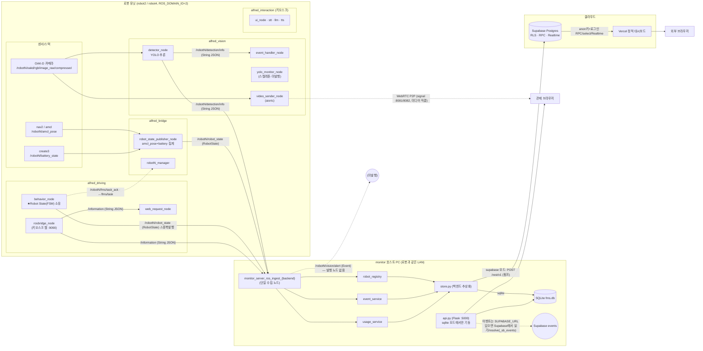

# ROS2 노드 아키텍처 — monitor2 (현행)

> 코드리뷰용. **현재 monitor2 설계**(ROS2 직수신 → store → SQLite/Supabase → Vercel) 기준.
> 기존 `ROBOT_UNIT_NODES.png`·`SYSTEM_ARCHITECTURE.png`·`DEPLOYMENT_TOPOLOGY.png`는 **옛 FMS+MQTT 설계**라 이 문서로 대체.
> 실제 코드(`src/*/*.py`의 `create_publisher/subscription`) 기준으로 작성. 불확실/단절 경로는 점선.

---

## 1. 노드 그래프

---

## 2. 노드 ↔ 토픽 표 (monitor 관련)

### 로봇 측 발행 (monitor가 소비)
| 노드 | 패키지 | 발행 토픽 | 타입 | monitor 콜백 |
|---|---|---|---|---|
| `robot_state_publisher_node` | alfred_bridge | `/{id}/robot_state` | `RobotState` | `_on_robot_state`→robot_registry |
| `behavior_node` | alfred_driving | `/{id}/robot_state` ⚠ | `RobotState` | 동일(중복 발행원) |
| `detector_node` | alfred_vision | `/{id}/detection/info` | `std_msgs/String`(JSON) | `_on_detection_info`→event_service |
| `rosbridge_node` | alfred_driving | `/information` | `std_msgs/String`(JSON) | `_on_information`→usage_service |
| (없음) | — | `/{id}/vision/alert` | `Event` | `_on_event` — **발행 노드 없음(단절)** |

### 로봇 측 입력(참고)
- `robot_state_publisher_node` ← `/{id}/amcl_pose`(nav2/amcl) + `/{id}/battery_state`(create3) 집계
- `detector_node` ← `/{id}/oakd/rgb/image_raw/compressed` (카메라)
- `rosbridge_node` ← 키오스크 웹(rosbridge 프로토콜 :9090) → `/information` 재발행
- `video_sender_node` ← 카메라 → **WebRTC P2P**(브라우저 직결, monitor/서버 우회)

### monitor 호스트
| 노드/모듈 | 역할 |
|---|---|
| `monitor_server_ros_ingest_{backend}` | 단일 수집 노드(이름에 BACKEND 접미사 → sqlite/supabase 동시 기동 충돌 방지) |
| `robot_registry`/`event_service`/`usage_service` | 정규화·검증 → store |
| `store.py` | sqlite(로컬) / supabase(펌프) 디스패치 |
| `api.py` (Flask) | sqlite 모드에서만 기동(:5000), 이벤트는 SUPABASE_URL 있으면 Supabase 단일소스 |

---

## 3. ⚠ 코드리뷰 시 짚을 노드 레벨 불일치 (실제 발견)

1. **`/robotN/robot_state` 이중 발행원**: `robot_state_publisher_node`(amcl_pose+battery 집계)와 `behavior_node`(FSM 상태 소유)가 **둘 다** `/{id}/robot_state`를 발행. 누가 권위 소스인지·동시 발행 시 충돌/덮어쓰기 여부 확인 필요.
2. **`/robotN/vision/alert` 단절**: monitor가 `_on_event`로 구독하지만 **이 토픽을 발행하는 노드가 코드에 없음**. 실제 이상감지는 `detector_node → /detection/info`(String JSON) 경로로만 들어옴. → vision/alert 구독은 죽은 경로(레거시 `Event` 타입 잔재).
3. **launch 불완전**: 현재 `unit.launch.py`가 띄우는 건 `{id}_manager`·`behavior_node`·`yolo_monitor_node`·`video_sender_node` 뿐. monitor가 필요로 하는 `robot_state_publisher_node`·`detector_node`·`rosbridge_node`는 **launch에 없음** → 별도 기동 전제. (yolo_monitor_node는 스켈레톤이라 아무것도 발행 안 함; 실제 탐지는 detector_node.)
4. **이벤트 타입 이원화**: 정형 `Event`(vision/alert, 미사용)와 비정형 `String`/JSON(detection/info, 실사용)이 공존. 계약 단일화 검토 대상.
5. **`/information` 다중 소비자**: `rosbridge_node`가 발행한 `/information`을 monitor(usage_service)와 `web_request_node`가 함께 구독 — 키오스크 명령과 사용 통계가 같은 토픽을 공유.

---

## 4. 데이터 평면 분리 (영상)
`video_sender_node`(:8081/8082)의 WebRTC 영상은 **제어/관측 평면(ROS·store·DB)을 거치지 않고** 브라우저와 직접 P2P. `video_sources.json`의 `signal_url`만 대시보드가 참조. → 노드 그래프에서 유일하게 store/DB로 안 흐르는 경로.
