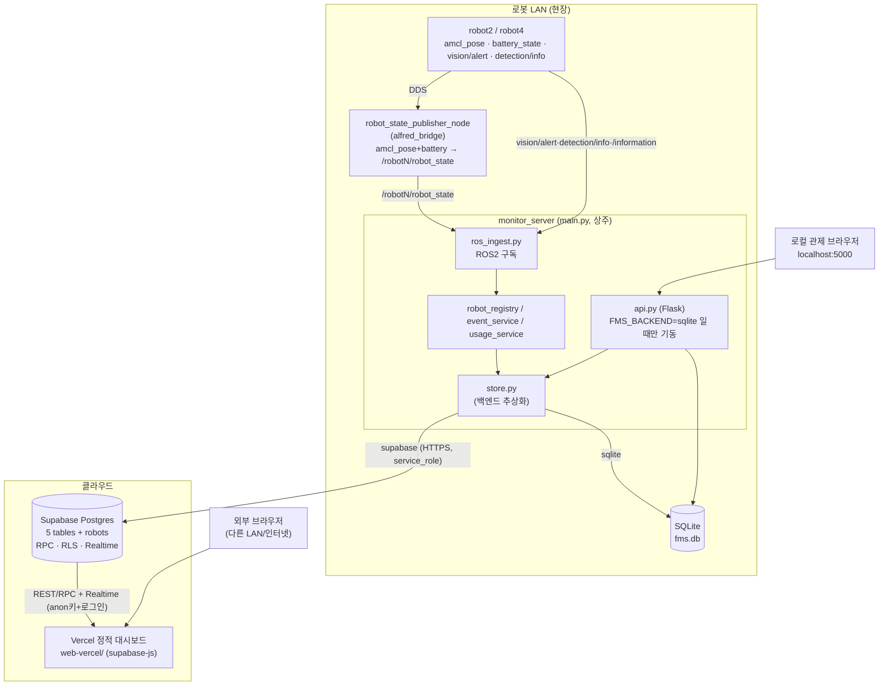
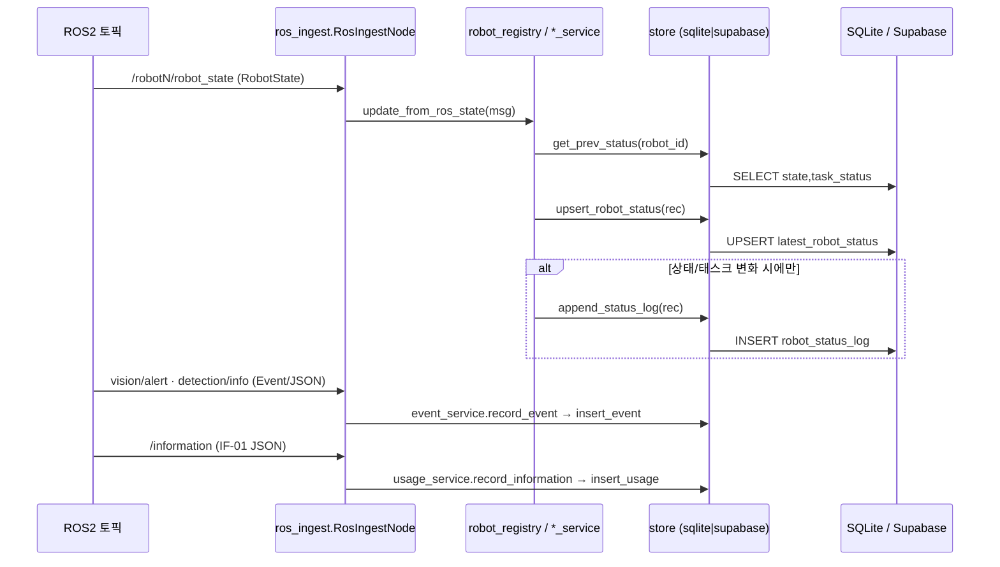
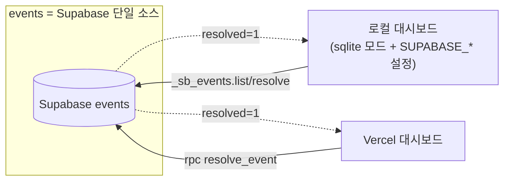

# 모니터링 시스템 코드 리뷰 자료

> 대상: `monitor_server`(ROS2 수집 + 로컬 대시보드 + Supabase 펌프) · `supabase/`(클라우드 DB/RPC/RLS) · `web-vercel/`(외부 대시보드) · `viz_3d/`(3D 관제 뷰)
> 브랜치: `monitor2` · 작성: 코드 리뷰 준비용 (아키텍처 / 플로우차트 / 리뷰 포인트)
> 📄 **파일별 상세(중요 코드·흐름·왜 필요)**: [`코드리뷰_파일별_상세.md`](./코드리뷰_파일별_상세.md)
> 🔗 **ROS2 노드 아키텍처(현행 monitor2)**: [`노드_아키텍처_monitor2.md`](./노드_아키텍처_monitor2.md)
> 📊 **DB→UI 데이터 흐름(테이블→API/RPC→화면)**: [`UI_데이터흐름_아키텍처.md`](./UI_데이터흐름_아키텍처.md)

---

## 0. 한 줄 요약

로봇이 ROS2(DDS, LAN)로 쏘는 상태·이벤트·사용현황을 **관측만** 해서, **로컬(SQLite+Flask)** 과 **클라우드(Supabase+Vercel)** 두 경로로 동일하게 보여주는 시스템. 백엔드는 환경변수 `FMS_BACKEND` 한 줄로 전환(`sqlite`|`supabase`). **임무 생성·로봇 제어는 일절 하지 않는다**(설계 불변식).

---

## 1. 시스템 아키텍처



> ⚠ **핵심 제약**: DDS는 LAN 전용 → 클라우드가 ROS 토픽을 직접 못 받는다. 그래서 로봇과 같은 망의 PC에서 `main.py`가 상주하며 수신→적재한다(아웃바운드 HTTPS만 사용, 인바운드 포트 개방 없음).

### 1.1 두 가지 실행 모드

| 모드 | 기동 | Flask(5000) | 적재 대상 | 화면 |
|---|---|---|---|---|
| `FMS_BACKEND=sqlite` (기본) | `python3 main.py` | **뜸** | 로컬 SQLite | localhost:5000 |
| `FMS_BACKEND=supabase` | `python3 main.py` | **안 뜸**(write-only 펌프) | Supabase | Vercel |
| 병행 | 두 프로세스 동시 | sqlite쪽만 | 각자 | 양쪽 |

근거: [main.py:44-53](../monitor_server/main.py#L44-L53) — `BACKEND=="supabase"`이면 Flask 스레드를 시작하지 않음.

---

## 2. 데이터 플로우

### 2.1 수집(ingest) 경로 — 공통



핵심 포인트:
- **변화 감지 로깅**: `robot_status_log`는 상태(state)나 task_status가 바뀔 때만 append → 로그 폭주 방지. ([robot_registry.py:56-72](../monitor_server/robot_registry.py#L56-L72))
- 그래서 매 상태 업데이트마다 `get_prev_status` 1회 선조회가 필요(=supabase 모드에선 메시지당 GET 왕복 1회, **§7 리뷰포인트**).

### 2.2 읽기 경로 — 로컬(localhost:5000)

```
브라우저 ──2초 폴링──> Flask /api/robots,/api/events,/api/stats,/api/system,/api/robot_log
                         └─ db.query_all (SQLite)  [이벤트만 _sb_events면 Supabase]
```

### 2.3 읽기 경로 — 클라우드(Vercel)

```
브라우저 ──supabase-js──> Supabase
  /api/robots   → rpc('get_robots')
  /api/stats    → rpc('get_stats')
  /api/system   → rpc('get_system')
  /api/search   → rpc('search_monitor')
  events        → from('events').select(...)
  resolve       → rpc('resolve_event')
  로그인         → Supabase Auth (anon키 + RLS)
```

### 2.4 이벤트 조치완료(resolve) 양방향 동기화 — "Option A"



- 로컬 `api.py`도 `.env`에 `SUPABASE_URL`이 있으면 **이벤트 목록/조치완료를 Supabase로 라우팅**한다(로봇·usage는 로컬 SQLite). 근거: [api.py:199-225](../monitor_server/api.py#L199-L225), `_sb_events` 분기.
- 결과: 누가 어디서 조치완료해도 같은 Supabase 행이 `resolved=1` → 양쪽 active 목록에서 동시에 사라짐.

---

## 3. 컴포넌트별 상세

### 3.1 monitor_server (Python)

| 파일 | 역할 | 핵심 |
|---|---|---|
| [main.py](../monitor_server/main.py) | 엔트리. `store.init` → `rclpy` → (sqlite면) Flask 스레드 → `rclpy.spin` | 모드 분기(L44), SIGINT/TERM 처리 |
| [ros_ingest.py](../monitor_server/ros_ingest.py) | ROS2 구독 노드. robot당 3토픽 + 전역 `/information` | rosbridge wrapping 언랩(`_unwrap_rosbridge_payload`) |
| [robot_registry.py](../monitor_server/robot_registry.py) | RobotState → 적재. 변화 감지 후 로그 append | `update_from_status` / `update_from_ros_state` |
| [event_service.py](../monitor_server/event_service.py) | IF-05 이벤트 적재. enum 밖이면 경고 후 기록 | `EVENT_TYPE_ALIASES` 정규화 |
| [usage_service.py](../monitor_server/usage_service.py) | IF-01 키오스크 사용현황 적재 | INTERACTING/ESCORT만, CANCEL 무시 |
| [store.py](../monitor_server/store.py) | **백엔드 추상화(Strategy)**. SqliteStore / SupabaseStore | supabase는 stdlib urllib + service_role |
| [db.py](../monitor_server/db.py) | SQLite(WAL). 스키마/마이그레이션/락 | 전역 `_lock` 직렬화 |
| [api.py](../monitor_server/api.py) | Flask 읽기 API + 대시보드 서빙 + 세션 로그인 | 이벤트는 `_sb_events`면 Supabase |
| [config.py](../monitor_server/config.py) | 토픽/로봇/포트/키 환경설정 | `FMS_BACKEND`, `SUPABASE_*` |
| [states.py](../monitor_server/states.py) | 상태/이벤트 enum + 별칭 | INJURED→EMERGENCY_PATIENT 별칭 |
| [poi.py](../monitor_server/poi.py) | POI 테이블 조회 헬퍼(관측 서버에선 사실상 미사용) | yaml 캐시 |

### 3.2 store.py — 백엔드 추상화 (리뷰 핵심)

- 인터페이스: `init/close/get_prev_status/upsert_robot_status/append_status_log/insert_event/insert_usage` (+ Supabase 전용 `list_events/resolve_event/event_stats`).
- `SqliteStore`는 기존 `db.py` 래핑, `SupabaseStore`는 **PostgREST를 stdlib urllib로 직접 호출**(외부 의존성 0). 근거: [store.py:106-199](../monitor_server/store.py#L106-L199)
- 모듈 레벨 디스패치 `get_backend()`가 `config.BACKEND`로 단일 인스턴스 선택. ([store.py:208-215](../monitor_server/store.py#L208-L215))

### 3.3 supabase/ (SQL 3종)

| 파일 | 내용 |
|---|---|
| [01_schema.sql](../monitor_server/supabase/01_schema.sql) | 테이블 5개(+인덱스) · Realtime publication · RLS 정책 |
| [02_functions.sql](../monitor_server/supabase/02_functions.sql) | `robots` 메타 + 집계 RPC 5종(get_robots/get_stats/search_monitor/get_system/resolve_event) |
| [03_grants.sql](../monitor_server/supabase/03_grants.sql) | 역할별 테이블 GRANT(service_role 전체 / authenticated 읽기 / anon 차단) |

- **RPC가 api.py 로직을 SQL로 재구현**: `get_robots`는 `_robot_snapshots`의 online/age_s 계산을 그대로 SQL로([02_functions.sql:45-77](../monitor_server/supabase/02_functions.sql#L45-L77)), `get_stats`는 `api.stats()`를 plpgsql로 미러링.
- 전부 `SECURITY DEFINER set search_path=public` + `execute`만 `authenticated`에 grant.

### 3.4 web-vercel/ (외부 대시보드)

- 정적 SPA, `supabase-js`(CDN) + `supabase-config.js`(url/anon키, **공개값**). vercel.json은 `cleanUrls` + config no-store.
- Flask `/api/*` → supabase rpc/select 매핑(§2.3). 폴링 + Realtime 구독.
- 영상(WebRTC) 탭은 외부 공개 부적합(TURN 필요)이라 **제거됨**(함수는 dead code 잔존).

### 3.5 viz_3d/ (3D 관제 뷰) — 상세

three.js(r128 CDN) **단일 HTML 파일**([viz_3d/index.html](../viz_3d/index.html), ~900줄). `/viz`로 서빙되어 두 대시보드(로컬/Vercel) iframe에 `?norobot`/임베드 모드로 들어간다.

**(a) 씬 구성 (정적 레이아웃)**
- `C`(색 팔레트) / `STATUS`(ok/warn/danger) 상수.
- `PLATE = {1:144.9×67, 2:66.2×53.6}` — 실측 비율(미터×18). **2F가 1F의 약 절반** → 라벨/가구 보정 필요의 근원.
- `DEFAULT_FLOOR_DATA = {1:[...], 2:[...]}` — 층별 `wall/zone/elevator/escalator/sofa/chair/desk` 항목 배열.
- 빌더: `floorPlate(w,d)` / `makeZone` / `makeWall` / `makeItem(it,floor)`(분기 + 가구 `FSCALE[floor]` 스케일) → `buildFloorInto(n)`가 `FLOOR_DATA[n].forEach(makeItem)`.
- `labelSprite(text)` — canvas 텍스처 스프라이트(존/로봇 라벨 공용). **`LABEL_SCALE={1:1,2:0.6}`** 로 2층 라벨 축소(최근 추가).

**(b) 로봇 마커 + 실시간 갱신**
- `robotMarker(name)` — ring/body/cap/beam + 이름 라벨. ring/body/cap/beam 참조를 `userData`에 저장(색 변경용).
- `pollRobots()` — **1초마다 `/api/robots`** fetch → `ROBOT_FLOOR`(robot2→1F, robot4→2F)로 층 매핑 → `setRobotPose(floor, x, y, theta)`(rosToScene 좌표 변환) → **`setRobotColor(floor, state)`** (최근 추가, `STATE_COLOR` 매핑) → 좌측 패널(배터리/속도/상태/목표) 갱신.
- `animate()` — ring 펄싱, 이벤트 비콘 펄싱, 층 전환 애니메이션(`FLOOR_GAP`로 2F를 띄움), 마커그룹 y 동기화.

**(c) 이벤트 비콘**
- `/api/events` 폴링 → `EVENT_STYLE`(FIRE/SUSPICIOUS_PERSON/EMERGENCY_PATIENT 색·이모지) → 해당 층 좌표에 비콘 마커(최근 50건 윈도우).

**(d) 편집/뷰 모드**
- 편집 모드: 항목 드래그 이동 + 패널(라벨/상태/W·D·X·Z/회전/복제/삭제) → `localStorage`(`LS_KEY`) 저장, 서버에는 `/api/floor_data` POST(로컬만; Vercel은 정적 스냅샷).
- 뷰: `1` / `2` / `combined`(1+2 적층). 카메라 `camV`로 2F는 확대.

**(e) ROS 직결 옵션(선택)**
- `?ros=ws://IP:9090` → roslibjs 동적 로드 후 `ROS_TOPICS={1:'/robot2/amcl_pose',2:'/robot4/amcl_pose'}` 구독 → `setRobotPose` 직접 호출(FMS 우회). `?rosdemo=1` 합성 pose 데모.

**(f) 리뷰 관점**
- 단일 파일 ~900줄 + 인라인 JS — 모듈화 안 됨(원래 vite/TS 프로젝트인데 `/viz`는 standalone index.html을 서빙). `src/`(TS) 버전과 **이원화** 소지.
- 좌표 변환 `rosToScene`/`PLATE` 비율이 하드코딩(맵 실측 의존) — 맵 바뀌면 수동 조정.
- Vercel에선 편집 저장이 localStorage 전용(서버 영속 없음) → 맵 변경은 `web-vercel/viz/maps/*` 재배포 필요.
- 로봇 매핑 `ROBOT_FLOOR` 하드코딩(robot2→1F, robot4→2F).

---

## 4. 데이터 모델

| 테이블 | 용도 | 키/특징 |
|---|---|---|
| `latest_robot_status` | 로봇별 최신 1행(스냅샷) | PK `robot_id`, UPSERT(`ON CONFLICT`) |
| `robot_status_log` | 상태 변화 이력 | 변화 시에만 append |
| `events` | IF-05 이상이벤트 | `resolved`(0/1)+`resolved_at`+`resolved_by` |
| `ui_usage_log` | IF-01 키오스크 사용 | language/customer_profile/escort_used |
| `monitor_counters` | 보정 카운터 | passengers/escorts/vulnerable 가산 |
| `robots`(supabase 전용) | 로봇 메타(config.ROBOTS) | get_robots 조인용 |

**SQLite → Postgres 이식 규칙**([01_schema.sql:4-8](../monitor_server/supabase/01_schema.sql#L4-L8)):
- ISO8601 text → `timestamptz`
- `INTEGER PRIMARY KEY AUTOINCREMENT` → `bigint generated always as identity`
- `REAL` → `double precision`
- `resolved`/`escort_used`는 대시보드 JS 호환 위해 **integer 0/1 유지**

---

## 5. API 표면 (Flask, 로컬)

| 라우트 | 메서드 | 설명 | 이벤트 소스 |
|---|---|---|---|
| `/login` `/logout` | GET/POST | 세션 로그인 | — |
| `/` `/viz` | GET | 대시보드 / 3D 뷰 HTML | — |
| `/api/robots` | GET | 로봇 스냅샷(online/age 계산) | SQLite |
| `/api/events` | GET | 이벤트(limit/active) | **Supabase if `_sb_events` else SQLite** |
| `/api/events/<id>/resolve` | POST | 조치완료 | 동일 |
| `/api/robot_log` | GET | 상태 로그 | SQLite |
| `/api/stats` | GET | 집계(이벤트/언어/프로필/카운터) | 이벤트만 Supabase 가능 |
| `/api/system` | GET | 행수·online·ROS 토픽·db ok | SQLite |
| `/api/search` | GET | 이벤트/상태 검색 | SQLite |
| `/api/maps` `/api/floor_data`(GET/POST) `/maps/<f>` `/api/video_sources` | — | 맵/층/영상 메타 | 파일 |

---

## 6. 보안 모델

| 계층 | 메커니즘 | 비고 |
|---|---|---|
| 로컬 Flask | 세션 쿠키 로그인(`ADMIN_USER/PASSWORD`) | 기본값 `admin/admin1234`, `SECRET_KEY` 미설정 시 `os.urandom`(재시작마다 세션 무효) |
| 로컬 CORS | `/api/*` `origins=CORS_ORIGINS` | 기본 `*` |
| 클라우드 쓰기 | **service_role 키**(RLS 우회) | **LAN PC에만**, 브라우저로 절대 X |
| 클라우드 읽기 | anon 키 + **RLS**(authenticated만 select) | 로그인 안 하면 0행 |
| 권한 | RLS 정책 + 테이블 GRANT 둘 다 필요 | [03_grants.sql](../monitor_server/supabase/03_grants.sql) 주석 참고 |
| resolve | `resolve_event` RPC(SECURITY DEFINER) | `resolved_by = auth.jwt()->>'email'` |

근거: [api.py:92-108](../monitor_server/api.py#L92-L108)(세션/CORS), [01_schema.sql:103-135](../monitor_server/supabase/01_schema.sql#L103-L135)(RLS).

---

## 7. 코드 리뷰 포인트 (논의/지적 거리)

### ✅ 강점 (설명 포인트)
1. **관측 전용 불변식**: 발행/명령 코드가 없음 — 구독만. 임무 제어와 책임 분리가 코드로 강제됨([main.py](../monitor_server/main.py) docstring, ros_ingest는 subscription만).
2. **백엔드 추상화(Strategy)**: `FMS_BACKEND` 한 줄로 SQLite↔Supabase 전환. SupabaseStore가 **추가 의존성 없이 stdlib urllib**로 PostgREST 호출 → 배포 단순.
3. **스키마 이식 일관성**: SQLite↔Postgres 타입 매핑 규칙을 주석으로 명문화, JS 호환 위해 0/1 유지.
4. **변화 감지 로깅**: 매 틱이 아니라 상태 변화 시에만 로그 append → 저장량 절감.
5. **보안 경계 명확**: service_role=LAN 전용/RLS 우회, anon+RLS=읽기, GRANT까지 self-contained.
6. **아웃바운드 전용**: 펌프가 바깥으로만 연결 → 로봇 LAN 인바운드 포트 개방 불필요.

### ⚠ 논의/개선 후보
1. **Supabase 쓰기가 ROS 콜백 스레드에서 동기 blocking**: `SupabaseStore._request`가 urllib 동기 호출(timeout 8s). 네트워크 지연 시 `rclpy` 실행기가 막혀 메시지 처리 지연 가능. → 큐/배치/비동기 또는 별도 워커 스레드 고려. ([store.py:123-144](../monitor_server/store.py#L123-L144))
2. **메시지당 GET 왕복(N+1)**: 변화 감지용 `get_prev_status`가 supabase 모드에서 상태 업데이트마다 네트워크 GET 1회. pose 고빈도면 부담 → 로컬 캐시(직전 상태 메모리 보관)로 제거 가능. ([robot_registry.py:38](../monitor_server/robot_registry.py#L38))
3. **로직 이중 구현(SQL ↔ Python)**: `get_stats`/`get_system`/`search_monitor`가 `api.py`의 동일 집계를 plpgsql로 재구현 → **두 곳을 동기화해야 하는 유지보수 비용**. 한쪽 변경 시 누락 위험.
4. **로컬 인증 하드닝 필요**: 기본 비번 `admin1234`, `SECRET_KEY` 미설정 시 매 재시작 세션 무효, CORS `*`. 외부 노출/터널 전 필수 교정.
5. **RLS가 행 스코프 없음**: `read_all ... using(true)` — 로그인한 누구나 전체 읽기(단일 운영팀 전제로는 OK지만, 다중 테넌트면 부족).
6. **로봇 상태 출처 이원화**: 로컬=SQLite, Vercel=Supabase로 **로봇 상태는 공유 안 됨**(이벤트만 단일 소스). 두 화면이 다른 데이터일 수 있어 운영 혼동 소지 → 문서/주석으로 명확히. 실제 운영은 두 프로세스가 같은 토픽을 각자 수신해 채움.
7. **반복 계산**: 한 번의 대시보드 폴링에서 `_robot_snapshots()`가 `/api/robots`·`/api/stats`·`/api/system`에서 각각 재계산. ([api.py:193,320,346](../monitor_server/api.py))
8. **전역 SQLite 락**: `db._lock`가 모든 쿼리를 직렬화([db.py:130-142](../monitor_server/db.py#L130-L142)). 단일 로컬 대시보드엔 무해하나 동시성 한계.
9. **의존성**: `robot_state_publisher_node`(alfred_bridge)가 없으면 `/robotN/robot_state`가 없어 적재 0 — 실로봇 토픽엔 그 토픽이 없고 이 노드가 amcl_pose+battery로 합성. 아키텍처 전제로 명시 필요.
10. **dead code**: web-vercel 영상 탭 제거 후 `buildVideoGrid/toggleVideo` 함수 잔존(무해하나 정리 여지).

---

## 8. 리뷰 진행 순서 추천

1. **불변식 확인** — "관측만 한다" (main/ros_ingest에 publish 없음) → 책임 경계
2. **수집 경로** — ros_ingest → registry → store (§2.1, 변화감지 로깅)
3. **백엔드 추상화** — store.py 두 구현 (§3.2, 동기 blocking·N+1 §7-1,2)
4. **데이터 모델/스키마 이식** — db.py ↔ 01_schema.sql (§4)
5. **클라우드 읽기** — RPC/RLS/GRANT (§3.3, 이중구현 §7-3, RLS 스코프 §7-5)
6. **보안** — service_role/anon/세션 (§6, 하드닝 §7-4)
7. **두 화면 데이터 출처 차이** (§7-6) — 운영 관점 합의

---

## 부록 A. 구독 토픽 / 상태 enum

- 구독: `/{robot}/robot_state`(RobotState), `/{robot}/vision/alert`(Event), `/{robot}/detection/info`(String JSON), `/information`(String JSON, IF-01)
- 로봇 상태: IDLE·PATROL·INTERACTING·RESERVED·HANDOVER_READY·WAITING_HANDOVER·ESCORTING·RETURNING·EMERGENCY·ERROR
- 이벤트: FIRE·SUSPICIOUS_PERSON·EMERGENCY_PATIENT(←INJURED_PERSON 별칭)·LOST_ITEM

## 부록 B. 관련 문서
- [monitor_server/README.md](../monitor_server/README.md) — 사용/구동
- [monitor_server/supabase/README.md](../monitor_server/supabase/README.md) — 클라우드 셋업
- [docs/실행_및_테스트_가이드_monitor2.md](실행_및_테스트_가이드_monitor2.md) — 실행/테스트
- [docs/아키텍처_클라우드_관제_monitor.md](아키텍처_클라우드_관제_monitor.md) — 초기 아키텍처 검토
